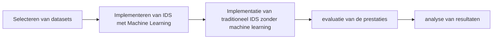

# Fase 5. Methodologie

- **Werktitel onderzoeksvoorstel:** Het verbeteren van netwerken van bedrijven aan de hand van Intrusion Detection systemen (IDS) die gebaseerd zijn op machine learning en nauwkeuriger cyberaanvallen kunnen detecteren.
- **Naam Student 1:** Jasper Van de Kerkhove
- **URL Github repo:** <https://github.com/HoGentTIN/rm-2223-paper-rmvandekerkhovej>

## Plan van aanpak

- **Fase 1: Selecteren van datasets**
    - **Doelstelling:** bepalen welke datasets gebruikt zullen worden voor het trainen van de machine learning modellen.
    - **Aanpak:**
        - De datasets die gebruikt zullen worden moeten aan bepoaalde voorwaarden voldoen om representatief te zijn. ze bevatten verschillende netwerkverkeergegevens zoals de netwerkprotocollen, gebruikers, locaties, verkeern applicaties en apparaten. Om de datasets te kunne trainen voor  machine learning moeten ze ook verschillende typen aanvallen bevatten zoals DoS, MITM, brute force, ...
    - **Resultaat, deliverable(s):** Een lijst van datasets die gebruikt zullen worden voor het trainen van de machine learning modellen
- **Fase 2: Implementeren van IDS met Machine Learning**
    - **Doelstelling:** Het implementeren van een IDS met machine learning.
    - **Aanpak:**
        - Er zal een IDS geïmplementeerd worden met machine learning. Deze zal getraind worden met de datasets die geselecteerd zijn in fase 2. De geschikte algoritmen zullen gekozen worden aan de hand van de literatuurstudie.
    - **Resultaat, deliverable(s):** Een IDS met machine learning die getraind is met de datasets die geselecteerd zijn in fase 2.
- **Fase 3: Implementatie van traditioneel IDS zonder machine learning**
    - **Doelstelling:** Het implementeren van een traditioneel IDS zonder machine learning.
    - **Aanpak:**
        -  Voor het implementeren van een traditioneel IDS zonder machine learning zullen we gebruik maken van een betaand IDS. Er kan gekozen worden uit verschillende open source systemen zoals Snort, Suricata, Bro, OSSEC, ... Deze zullen getest worden op dezlfde manier als de IDS met machine learning.
    - **Resultaat, deliverable(s):** Een traditioneel IDS zonder machine learning.
- **Fase 4: evaluatie van de prestaties**
    - **Doelstelling:**  Het evalueren van de prestaties van de IDS met machine learning en de traditionele IDS.
    - **Aanpak:**
        - Voer een vergelijkende evaluatie uit tussen het IDS-systeem met Machine Learning en het traditionele IDS-systeem. Evalueer de prestaties op basis van verschillende criteria, zoals het aantal correct gedetecteerde aanvallen, het aantal false positives en de reactietijd van het systeem. 
    - **Resultaat, deliverable(s):** Een evaluatie van de prestaties van de IDS met machine learning en de traditionele IDS.
- **Fase 5: analyse van resultaten**
    - **Doelstelling:** Het analyseren van de resultaten van de IDS met machine learning en de traditionele IDS.
    - **Aanpak:**
        -  De resultaten van de IDS met machine learning en de traditionele IDS zullen geanalyseerd worden. Er zal gekeken worden naar de nauwkeurigheid van de detectie van de aanvallen en de false positives. Er zal ook gekeken worden naar de performantie van de systemen.
    - **Resultaat, deliverable(s):** Een analyse van de resultaten van de IDS met machine learning en de traditionele IDS en een conclusie trekken uit het onderzoek.

## Verloop

### Flowchart

